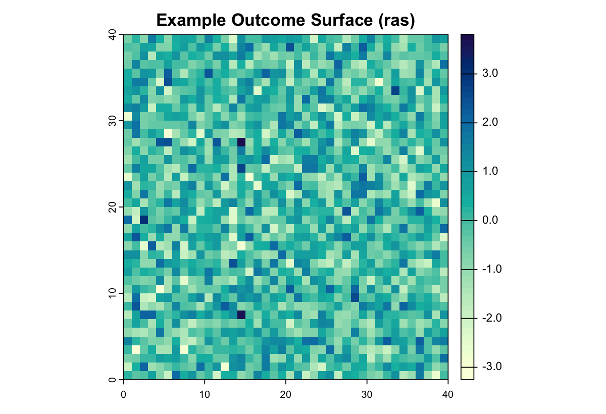
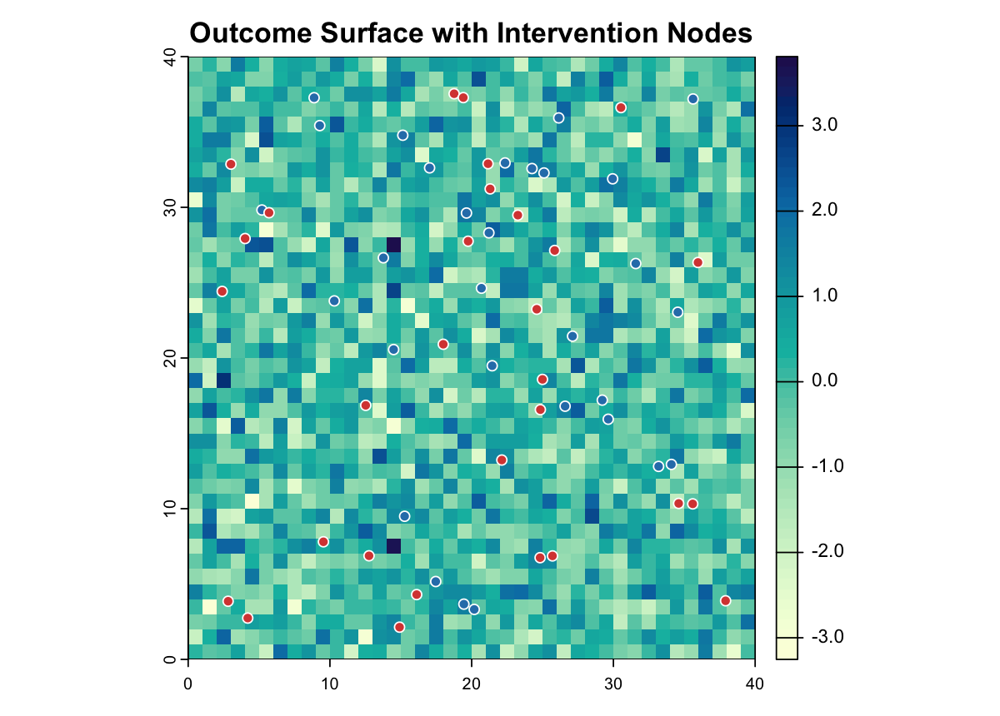
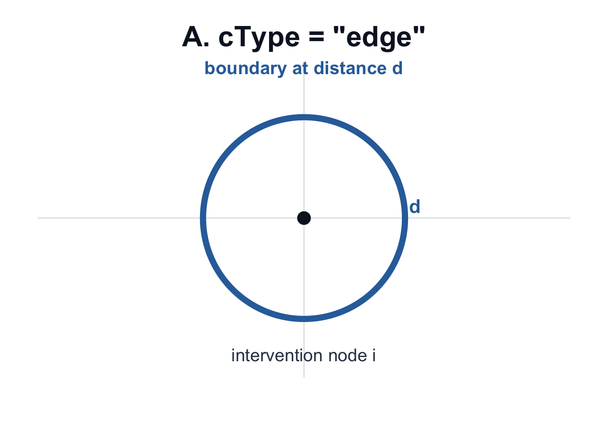
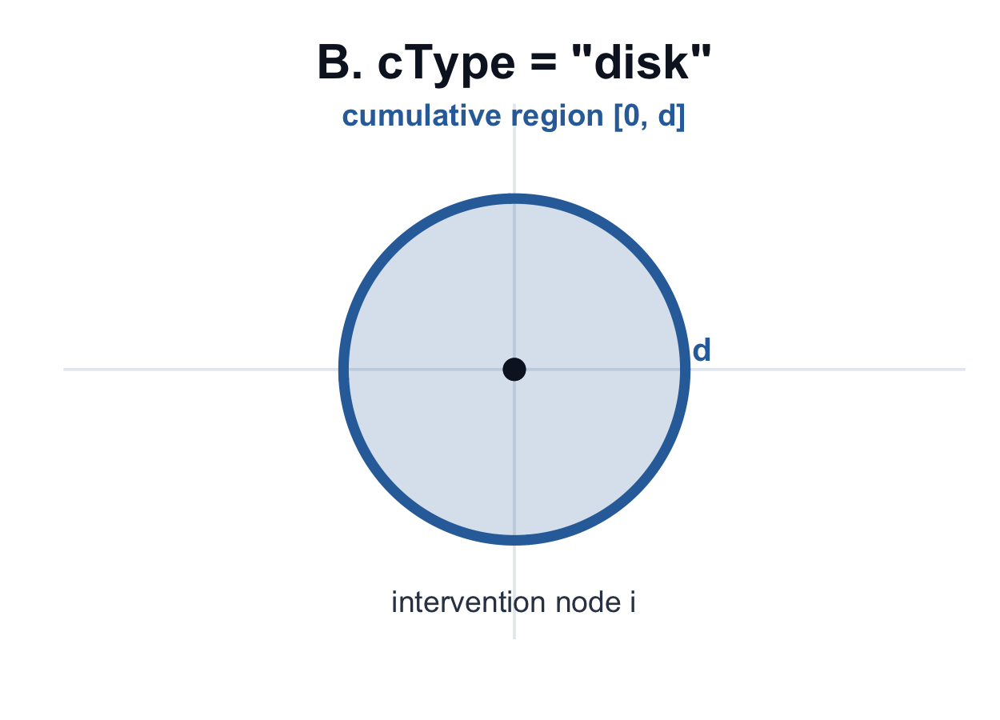
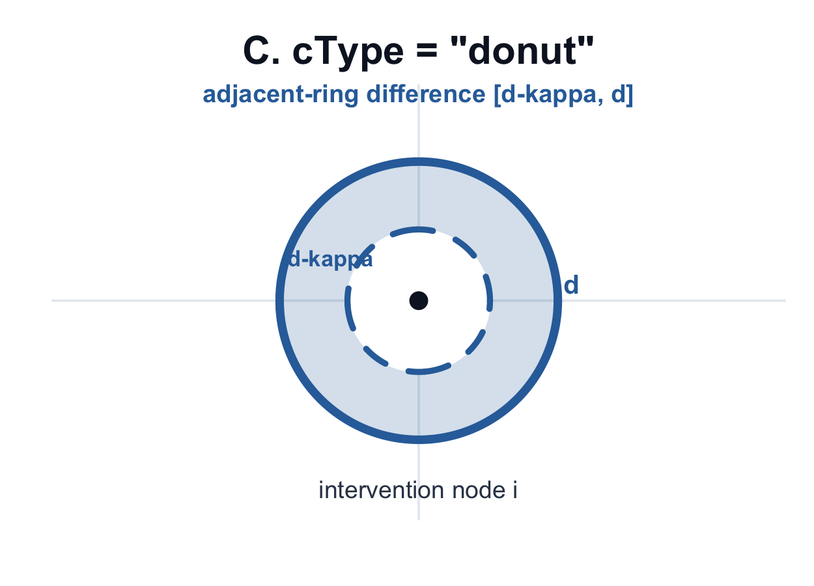

```{r setup, include=FALSE}
knitr::opts_chunk$set(
  collapse = TRUE,
  comment = "#>",
  warning = FALSE,
  message = FALSE,
  fig.path = "man/figures/"
)
```

`SpatialEffect2` estimates distance-indexed **Average Marginalized Effects (AME)**
for spatial interventions under unknown interference. This tutorial uses a
small synthetic point-intervention example so the full workflow runs quickly:
prepare an outcome raster, define intervention nodes, estimate the AME curve,
add uncertainty, test a distance range, and plot the result.

## 1. Setup

```{r}
library(SpatialEffect2)
library(terra)

packageVersion("SpatialEffect2")
```

## 2. Prepare Inputs

### Outcome surface (`ras`)

```{r}
set.seed(2026)
ras <- rast(nrows = 40, ncols = 40, xmin = 0, xmax = 40, ymin = 0, ymax = 40)
values(ras) <- rnorm(ncell(ras))

ras
```

{width=70%}

### Point interventions (`Zdata`)

```{r}
nz <- 60
Zdata <- data.frame(
  x = runif(nz, 2, 38),
  y = runif(nz, 2, 38),
  treat = rbinom(nz, 1, 0.5)
)

head(Zdata, 6)
```

{width=70%}

Required columns for point mode:

- treatment column (`0/1`)
- x/y intervention coordinates

For polygon interventions, pass `ras_Z` as `sf`/`SpatVector`/`SpatRaster` and
keep one row in `Zdata` per polygon.

## 3. Choose Distance Design

1. `cType = "edge"`: boundary at distance `d` (Figure A below)

{width=62%}

2. `cType = "disk"`: cumulative region `[0, d]` (Figure B below)

{width=62%}

3. `cType = "donut"`: adjacent-ring difference (often most interpretable, Figure C below)

{width=62%}

```{r}
dVec <- seq(0, 5, by = 1)
dVec
```

Practical tip: under `donut`, choose `dVec` step size close to raster
resolution to reduce empty-ring `NA` issues.

## 4. Estimate AME Curve with Uncertainty

```{r}
result <- SpatialEffect(
  ras = ras,
  Zdata = Zdata,
  x_coord_Z = "x",
  y_coord_Z = "y",
  treatment = "treat",
  dVec = dVec,
  cType = "donut",
  dist.metric = "Euclidean",
  smooth = 0,
  per.se = 1,
  conley.se = 1,
  cutoff = 2,
  alpha = 0.05,
  nPerms = 200,
  perm_engine = "shuffle",
  n_threads = 1L
)

ame_table <- data.frame(
  d = result$AME_est$d,
  AME = result$AME_est$taud_est,
  Conley_SE = result$Conley.SE,
  Conley_lwr = result$Conley.CI[, 1],
  Conley_upr = result$Conley.CI[, 2],
  Perm_lwr = result$Per.CI[, 1],
  Perm_upr = result$Per.CI[, 2]
)

head(ame_table, 6)
```

## 5. Understand Outputs

`SpatialEffect(...)` returns class `"SpatialEffect"`.

Common slots:

- `AME_est`: data frame with `d`, `taud_est`
- `Per.CI`: permutation CI matrix (`length(dVec) x 2`) when `per.se = 1`
- `Conley.SE`, `Conley.CI`: spatial HAC uncertainty when `conley.se = 1`
- `AME_est_smoothed`: smoothed AME curve when `smooth = 1`
- `Parameters`: stored intermediate objects/settings

```{r}
names(result)
summary(result, dVec.range = c(1, 3))
```

## 6. Test Policy-Relevant Distance Ranges

```{r}
test <- SpatialEffectTest(
  result.list = result,
  test.range = c(1, 3),
  smooth = 0,
  alpha = 0.05
)

test
```

## 7. Plot Result with `plot()`

Because `result` is a `"SpatialEffect"` object, `graphics::plot(result, ...)`
dispatches to the package's S3 method, `plot.SpatialEffect()`.

```{r plot-result-s3, fig.alt="AME curve with confidence intervals rendered by the SpatialEffect S3 plot method.", out.width="72%"}
graphics::plot(
  result,
  smooth = FALSE,
  ci.type = "both",
  style = "lines",
  main = "Estimated AME by Distance"
)
```

You can also switch to shaded confidence bands:

```{r, eval=FALSE}
graphics::plot(
  result,
  smooth = FALSE,
  ci.type = "both",
  style = "shade",
  main = "AME with Conley and Permutation CIs"
)
```

## 8. Next Step

This tutorial shows the mechanics of a complete run. For guidance on choosing
`cType`, `dVec`, uncertainty options, and diagnostics, see the
[Analysis Workflow](reference/SpatialEffect2-workflow.html).
