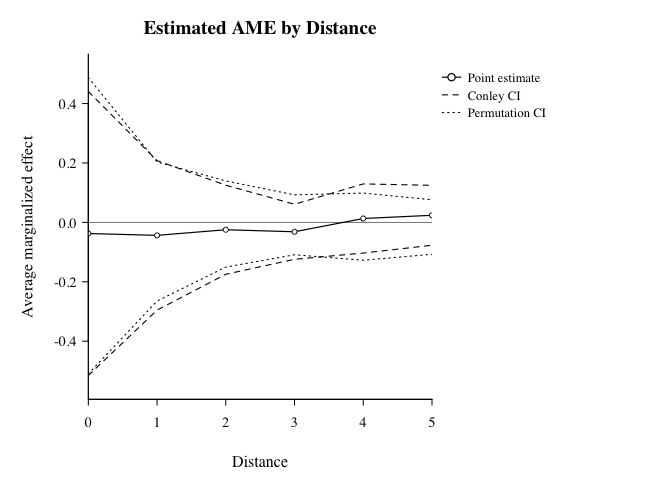

SpatialEffect2 Tutorial
================

`SpatialEffect2` estimates distance-indexed **Average Marginalized
Effects (AME)** for spatial interventions under unknown interference.
This tutorial uses a small synthetic point-intervention example so the
full workflow runs quickly: prepare an outcome raster, define
intervention nodes, estimate the AME curve, add uncertainty, test a
distance range, and plot the result.

## 1. Setup

``` r
library(SpatialEffect2)
library(terra)

packageVersion("SpatialEffect2")
#> [1] '0.2.0'
```

## 2. Prepare Inputs

### Outcome surface (`ras`)

``` r
set.seed(2026)
ras <- rast(nrows = 40, ncols = 40, xmin = 0, xmax = 40, ymin = 0, ymax = 40)
values(ras) <- rnorm(ncell(ras))

ras
#> class       : SpatRaster 
#> dimensions  : 40, 40, 1  (nrow, ncol, nlyr)
#> resolution  : 1, 1  (x, y)
#> extent      : 0, 40, 0, 40  (xmin, xmax, ymin, ymax)
#> coord. ref. : lon/lat WGS 84 (CRS84) (OGC:CRS84) 
#> source(s)   : memory
#> name        :     lyr.1 
#> min value   : -3.048044 
#> max value   :  3.416480
```

<figure>

<figcaption aria-hidden="true">Example outcome surface
(ras)</figcaption>
</figure>

### Point interventions (`Zdata`)

``` r
nz <- 60
Zdata <- data.frame(
  x = runif(nz, 2, 38),
  y = runif(nz, 2, 38),
  treat = rbinom(nz, 1, 0.5)
)

head(Zdata, 6)
#>           x        y treat
#> 1  9.644531 11.46395     0
#> 2 15.268587 10.50909     1
#> 3 33.337356 12.96211     1
#> 4 21.835087 21.33355     0
#> 5 12.222365 36.60885     0
#> 6 37.129211 37.89930     0
```

<figure>

<figcaption aria-hidden="true">Outcome surface with intervention nodes
(red = treated, blue = control)</figcaption>
</figure>

Required columns for point mode:

- treatment column (`0/1`)
- x/y intervention coordinates

For polygon interventions, pass `ras_Z` as
`sf`/`SpatVector`/`SpatRaster` and keep one row in `Zdata` per polygon.

## 3. Choose Distance Design

1.  `cType = "edge"`: boundary at distance `d` (Figure A below)

<figure>

<figcaption aria-hidden="true">Figure A: edge design</figcaption>
</figure>

2.  `cType = "disk"`: cumulative region `[0, d]` (Figure B below)

<figure>

<figcaption aria-hidden="true">Figure B: disk design</figcaption>
</figure>

3.  `cType = "donut"`: adjacent-ring difference (often most
    interpretable, Figure C below)

<figure>

<figcaption aria-hidden="true">Figure C: donut design</figcaption>
</figure>

``` r
dVec <- seq(0, 5, by = 1)
dVec
#> [1] 0 1 2 3 4 5
```

Practical tip: under `donut`, choose `dVec` step size close to raster
resolution to reduce empty-ring `NA` issues.

## 4. Estimate AME Curve with Uncertainty

``` r
result <- SpatialEffect(
  ras = ras,
  Zdata = Zdata,
  x_coord_Z = "x",
  y_coord_Z = "y",
  treatment = "treat",
  dVec = dVec,
  cType = "donut",
  dist.metric = "Euclidean",
  smooth = 0,
  per.se = 1,
  conley.se = 1,
  cutoff = 2,
  alpha = 0.05,
  nPerms = 200,
  perm_engine = "shuffle",
  n_threads = 1L
)

ame_table <- data.frame(
  d = result$AME_est$d,
  AME = result$AME_est$taud_est,
  Conley_SE = result$Conley.SE,
  Conley_lwr = result$Conley.CI[, 1],
  Conley_upr = result$Conley.CI[, 2],
  Perm_lwr = result$Per.CI[, 1],
  Perm_upr = result$Per.CI[, 2]
)

head(ame_table, 6)
#>   d         AME  Conley_SE  Conley_lwr Conley_upr   Perm_lwr   Perm_upr
#> 1 0 -0.03750097 0.24392269 -0.51558065 0.44057872 -0.5100804 0.48739127
#> 2 1 -0.04369783 0.12841707 -0.29539067 0.20799501 -0.2648224 0.20345510
#> 3 2 -0.02479922 0.07645815 -0.17465443 0.12505600 -0.1505803 0.13944603
#> 4 3 -0.03163822 0.04726418 -0.12427430 0.06099786 -0.1089905 0.09266432
#> 5 4  0.01308657 0.05938572 -0.10330731 0.12948045 -0.1274640 0.09868982
#> 6 5  0.02384883 0.05148026 -0.07705063 0.12474828 -0.1074437 0.07613412
```

## 5. Understand Outputs

`SpatialEffect(...)` returns class `"SpatialEffect"`.

Common slots:

- `AME_est`: data frame with `d`, `taud_est`
- `Per.CI`: permutation CI matrix (`length(dVec) x 2`) when `per.se = 1`
- `Conley.SE`, `Conley.CI`: spatial HAC uncertainty when `conley.se = 1`
- `AME_est_smoothed`: smoothed AME curve when `smooth = 1`
- `Parameters`: stored intermediate objects/settings

``` r
names(result)
#> [1] "AME_est"    "Per.CI"     "Conley.SE"  "Conley.CI"  "Parameters"
#> [6] "call"
summary(result, dVec.range = c(1, 3))
#> Call: SpatialEffect
#> 
#>      dVec AME_est Conley.CI.l Conley.CI.u Per.CI.l Per.CI.u
#> [1,]    1  -0.044      -0.295       0.208   -0.265    0.203
#> [2,]    2  -0.025      -0.175       0.125   -0.151    0.139
#> [3,]    3  -0.032      -0.124       0.061   -0.109    0.093
```

## 6. Test Policy-Relevant Distance Ranges

``` r
test <- SpatialEffectTest(
  result.list = result,
  test.range = c(1, 3),
  smooth = 0,
  alpha = 0.05
)

test
#> $test.stat
#> [1] -0.1001353
#> 
#> $test.CI
#>       2.5%      97.5% 
#> -0.3809472  0.4064966
```

## 7. Plot Result with `plot()`

Because `result` is a `"SpatialEffect"` object,
`graphics::plot(result, ...)` dispatches to the package’s S3 method,
`plot.SpatialEffect()`.

``` r
graphics::plot(
  result,
  smooth = FALSE,
  ci.type = "both",
  style = "lines",
  main = "Estimated AME by Distance"
)
```



You can also switch to shaded confidence bands:

``` r
graphics::plot(
  result,
  smooth = FALSE,
  ci.type = "both",
  style = "shade",
  main = "AME with Conley and Permutation CIs"
)
```

## 8. Next Step

This tutorial shows the mechanics of a complete run. For guidance on
choosing `cType`, `dVec`, uncertainty options, and diagnostics, see the
[Analysis Workflow](reference/SpatialEffect2-workflow.html).
